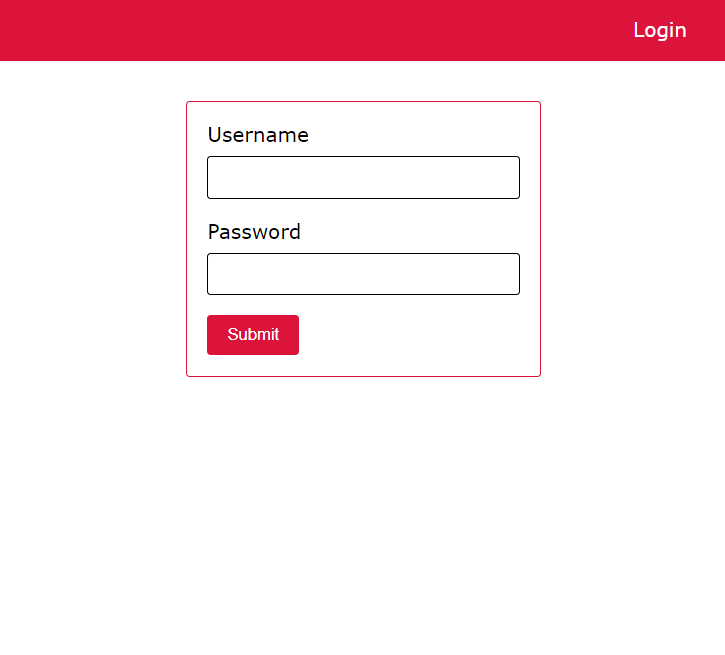
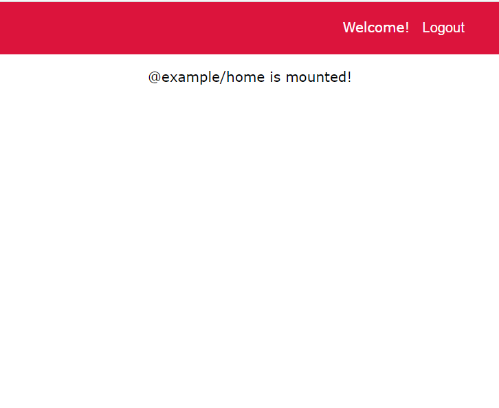
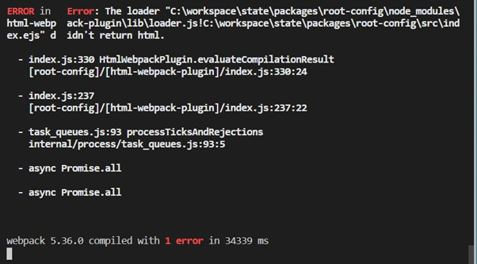

# Data Transfer에 대하여

정주현, 남기훈

single-spa-example-rxjs-shared-state 예제를 기반으로 분석

<br>

### 한계

- 예제 중 핵심 부분이 React.js, svelte 기반
- 뒤늦게 찾아낸 방법이라 Vue.js에 적용해보지 못함

### 예제 파일 구성

- **root-config**: 다른 앱들이 구현 될 HTML 레이아웃
- **navbar** :Svelte 앱 기반 상단 바로, 로그인 시 'Login'이라는 문자가 'Logout'으로 바뀌고, 클릭하면 로그인 이전 상태로 돌아간다.(로그인이라는 event에 따른 변화)
- **home**: 로그인 완료시 표시되는 React 기반 앱
- **login**: 로그인 창을 가진 React 기반 앱
- **auth**: Rxjs 및 일반 JavaScript를 사용하는 유틸리티 모듈

### 구현 모습

- 로그인 전
  

- 로그인 후
  

### 예제 속 Data Transfer

#### navbar

Navbar.svelte

```javascript
import { auth$ as auth, logout } from "@example/auth";
<nav>
  <Router>
    {#if $auth.sessionToken}
      <span>Welcome!</span>
      <button class="action" type="button" on:click|once={logout}>Logout</button
      >
    {:else}<span>Login</span>{/if}
  </Router>
</nav>
```

- 로그인 되었을 시, if조건이 충족되어 로그인 후의 상태로 바뀐다. 따라서, $auth.sessionToken 부분이 event를 전달해주는 역할을 함을 알 수 있다.

#### auth

src/example-auth.js

```javascript
import { BehaviorSubject } from "rxjs";

export const auth$ = new BehaviorSubject({
  sessionToken: localStorage.getItem("sessionToken"),
  error: false,
  pending: false,
});

const GET_LOGGED_IN = (username, password) =>
  new Promise((resolve, reject) => {
    auth$.next({
      sessionToken: null,
      error: false,
      pending: true,
    });
    setTimeout(() => {
      if (username === "exampleuser" && password === "examplepassword") {
        const sessionToken = "abc123def456";
        localStorage.setItem("sessionToken", sessionToken);
        resolve({
          sessionToken,
          error: false,
          pending: false,
        });
      } else {
        resolve({
          sessionToken: null,
          error: "Invalid user or password",
          pending: false,
        });
      }
    }, 2500);
  });

export function login(username, password) {
  if (!auth$.value.pending) {
    GET_LOGGED_IN(username, password).then((user) => {
      auth$.next(user);
    });
  }
}
```

- 해당 코드에서 로그인 함에 따라 $auth.sessionToken 부분의 변화를 확인 가능하다. 따라서 이 곳에서의 변화를 바탕으로 navbar가 event 정보를 받는 것으로 추정 가능하다.

<br>

_→ 따라서, import 방식을 이용해, 로그인시 특정값을 변하게 만들어, 그 값을 받으면 event가 일어났다고 인식하도록 만드는 것이 핵심이라고 추정...한다._

<br>

### 발생 이슈

- 처음에 발견한 방법이 앱들간의 event 발생의 공유가 아닌, js파일을 여러 앱에 공유하는 방식에 대한 방법이었다. 분석이 마무리될 즈음 이를 깨닫고 새로운 방법을 찾기 시작함.

- 예제 실행 중 아래와 같은 에러 발생
  
  → yarn이 제대로 설치되지 않은 것으로 판명
