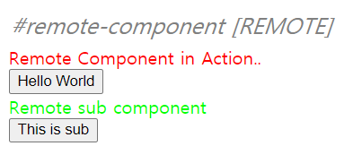

## High Level Concepts 기반

각각의 빌드는 컨테이너의 역할을 가지며, 또한 다른 빌드의 컨테이너들을 사용하기도 한다. 이러한 방법을 통해 각각의 빌드는 노출된 모듈을 컨테이너로부터 로드하는 것을 통해 모두 접근 가능하다.

공유된 모듈(shared modules)은 override 가능하고 중첩된 컨테이너에 대하여 overrides로 제공된 모듈들을 말한다. 일반적으로 각 빌드에서 동일한 모듈을 가리킨다.(예. 동일한 라이브러리)

packageName 옵션은 requredVersion을 찾는 패키지 이름을 설정할 수 있도록 한다. 이는 자동적으로 디폴트로 지정된다. 이를 비활성화 하고 싶을 경우, requiredVersion을 false로 설정한다.

## ModuleFederationPlugin(High Level)

이 플러그인은 ContainerPlugin 과 ContainerReferencePlugin을 결합한다. overrides와 overridables는 지정된 공유 모듈(shared modules)의 단일 리스트로 결합된다.

## 예제를 통한 이해

### **Home의 경우**

webpack.config.js

```javascript
plugins: [
  new ModuleFederationPlugin({
    name: "home",
    filename: "remoteEntry.js",
    remotes: {
      home: "home@http://localhost:3002/remoteEntry.js",
    },
    exposes: {
      //내보낼(공유할) 컴포넌트
      "./Content": "./src/components/Content",
      "./Button": "./src/components/Button",
    },
  }),
];
```

<br>

### **Layout의 경우**

webpack.config.js

```javascript
plugins: [
  new ModuleFederationPlugin({
    name: "layout",
    filename: "remoteEntry.js",
    remotes: {
      home: "home@http://localhost:3002/remoteEntry.js",
    },
    exposes: {}, //내보내지 않고 받기만 해서 텅빔
  }),
  new HtmlWebpackPlugin({
    template: path.resolve(__dirname, "./index.html"),
    chunks: ["main"],
  }),
];
```

main.js

```javascript
import Layout from "./Layout.vue";

const Content = defineAsyncComponent(() => import("home/Content"));
const Button = defineAsyncComponent(() => import("home/Button"));

const app = createApp(Layout);

app.component("content-element", Content);
app.component("button-element", Button);
```

home의 컴포넌트들을 content-element, button-element라는 태그로 layout에서 사용할 수 있도록 함.

## 서브 컴포넌트 앱 추가 해보기

1. home 폴더를 복사해서 sub라는 이름의 폴더로 변경
2. home의 컴포넌트와의 차이를 주기 위해 컴포넌트의 제목과 내용을 변경
3. package.json에서 이름을 /sub로 변경, scripts에서 serve를 3003번 포트로 변경
4. devServer에서 port를 3003번으로 변경
5. sub 폴더 메인 앱에서 컴포넌트 정보 변경(제목을 바꿈에 따른 import 주소 변경, 태그명 변경)
6. webpack.config.js에서 ModuleFederationPlugin 중 exposes에 내보낼 컴포넌트 등록
7. layout main.js에 등록

_=> 여기까지 하면 sub 자체 실행은 잘 되지만, layout에 등록시 에러 발생_

8. layout의 webpack.config.js에 ModuleFederationPlugin에 리모트할 컴포넌트 주소 추가

```javascript
      remotes: {
        home: "home@http://localhost:3002/remoteEntry.js",
        sub: "sub@http://localhost:3003/remoteEntry.js",
      }
```



잘됨
